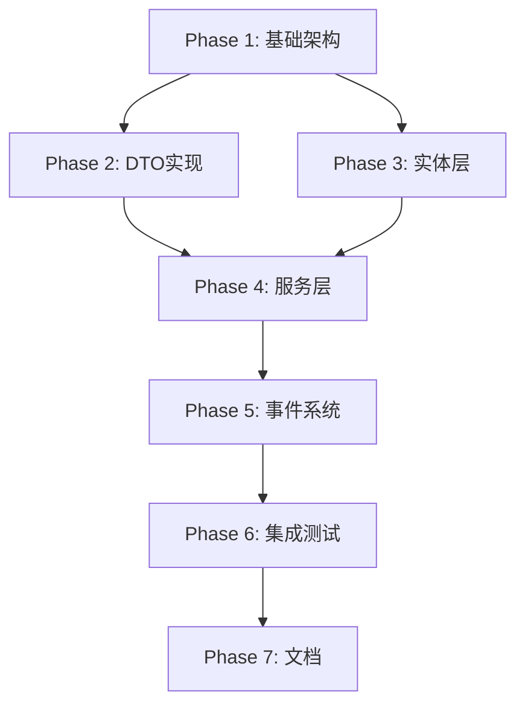

# order-refund-bundle 任务分解（TDD方法论）

## 📋 任务概览

基于完全独立架构的技术设计，将开发任务分解为以下阶段，采用测试驱动开发（TDD）方法论。

**预估总工时**：40-48小时

## 🎯 Phase 1: 基础架构搭建（8小时）

### Task 1.1: 创建包基础结构
**优先级**：P0（必须）  
**预估时间**：2小时  
**依赖**：无

#### 测试先行
```php
// tests/DependencyTest.php
class DependencyTest extends TestCase
{
    public function testNoOrderCoreBundleDependency(): void
    {
        $composerJson = json_decode(file_get_contents(__DIR__ . '/../composer.json'), true);
        $this->assertArrayNotHasKey('tourze/order-core-bundle', $composerJson['require'] ?? []);
    }
    
    public function testBundleCanBeLoaded(): void
    {
        $bundle = new OrderRefundBundle();
        $this->assertInstanceOf(Bundle::class, $bundle);
    }
}
```

#### 实现任务
1. 创建目录结构
```bash
packages/order-refund-bundle/
├── src/
│   ├── Entity/
│   ├── Repository/
│   ├── Service/
│   ├── DTO/
│   ├── Event/
│   ├── Contract/
│   ├── Enum/
│   ├── Exception/
│   └── OrderRefundBundle.php
├── config/
│   └── services.php
├── tests/
├── composer.json
└── README.md
```

2. 配置 composer.json（不依赖 order-core-bundle）
```json
{
    "name": "tourze/order-refund-bundle",
    "type": "symfony-bundle",
    "require": {
        "php": "^8.2",
        "symfony/framework-bundle": "^7.4",
        "doctrine/orm": "^3.0",
        "doctrine/doctrine-bundle": "^2.13"
    }
}
```

3. 创建 Bundle 主类
```php
namespace Tourze\OrderRefundBundle;

use Symfony\Component\HttpKernel\Bundle\Bundle;

class OrderRefundBundle extends Bundle
{
    public function getPath(): string
    {
        return \dirname(__DIR__);
    }
}
```

### Task 1.2: 配置服务容器
**优先级**：P0  
**预估时间**：1小时  
**依赖**：Task 1.1

#### 测试先行
```php
// tests/DependencyInjection/ConfigurationTest.php
class ConfigurationTest extends TestCase
{
    public function testServicesAreRegistered(): void
    {
        $container = $this->getContainer();
        $this->assertTrue($container->has(AftersalesService::class));
        $this->assertTrue($container->has(SnapshotService::class));
    }
}
```

#### 实现任务
创建 config/services.php

### Task 1.3: 创建异常类体系
**优先级**：P1  
**预估时间**：1小时  
**依赖**：Task 1.1

#### 测试先行
```php
// tests/Exception/ExceptionHierarchyTest.php
class ExceptionHierarchyTest extends TestCase
{
    public function testExceptionHierarchy(): void
    {
        $this->assertInstanceOf(
            AftersalesException::class,
            new InvalidOrderDataException()
        );
    }
}
```

### Task 1.4: 创建枚举类
**优先级**：P1  
**预估时间**：1小时  
**依赖**：Task 1.1

#### 测试先行
```php
// tests/Enum/AftersalesTypeTest.php
class AftersalesTypeTest extends TestCase
{
    public function testValidTypes(): void
    {
        $this->assertEquals('refund_only', AftersalesType::REFUND_ONLY);
        $this->assertEquals('return_refund', AftersalesType::RETURN_REFUND);
    }
}
```

### Task 1.5: 数据库迁移准备
**优先级**：P0  
**预估时间**：3小时  
**依赖**：Task 1.1

#### 测试先行
```php
// tests/Migration/SchemaTest.php
class SchemaTest extends KernelTestCase
{
    public function testDatabaseSchemaIsValid(): void
    {
        $validator = static::getContainer()->get('doctrine.orm.validator');
        $errors = $validator->validateMapping();
        $this->assertCount(0, $errors);
    }
}
```

## 🎯 Phase 2: 数据传输对象（DTO）实现（6小时）

### Task 2.1: 实现 OrderDataDTO
**优先级**：P0  
**预估时间**：2小时  
**依赖**：Task 1.1

#### 测试先行
```php
// tests/DTO/OrderDataDTOTest.php
class OrderDataDTOTest extends TestCase
{
    public function testCreateFromArray(): void
    {
        $data = [
            'orderNumber' => 'ORD001',
            'orderStatus' => 'paid',
            'orderCreatedAt' => '2024-01-01',
            'userId' => 'user_001',
            'totalAmount' => 100.00
        ];
        
        $dto = OrderDataDTO::fromArray($data);
        
        $this->assertEquals('ORD001', $dto->orderNumber);
        $this->assertEquals('paid', $dto->orderStatus);
        $this->assertInstanceOf(\DateTimeInterface::class, $dto->orderCreatedAt);
    }
    
    public function testValidation(): void
    {
        $dto = new OrderDataDTO('', 'paid', new \DateTime(), 'user', 100);
        $errors = $dto->validate();
        
        $this->assertContains('订单编号不能为空', $errors);
    }
    
    public function testNoContractDependency(): void
    {
        $reflection = new \ReflectionClass(OrderDataDTO::class);
        $uses = $this->getClassUses($reflection);
        
        $this->assertNotContains('OrderCoreBundle\Entity\Contract', $uses);
    }
}
```

#### 实现任务
1. 创建 OrderDataDTO 类
2. 实现 fromArray 方法
3. 实现 validate 方法
4. 确保不引用任何 Contract 实体

### Task 2.2: 实现 ProductDataDTO
**优先级**：P0  
**预估时间**：2小时  
**依赖**：Task 1.1

#### 测试先行
```php
// tests/DTO/ProductDataDTOTest.php
class ProductDataDTOTest extends TestCase
{
    public function testCreateFromArray(): void
    {
        $data = [
            'productId' => 'prod_001',
            'skuId' => 'sku_001',
            'productName' => '测试商品',
            'skuName' => '默认规格',
            'originalPrice' => 100.00,
            'paidPrice' => 90.00,
            'discountAmount' => 10.00,
            'orderQuantity' => 2
        ];
        
        $dto = ProductDataDTO::fromArray($data);
        
        $this->assertEquals('prod_001', $dto->productId);
        $this->assertEquals(90.00, $dto->paidPrice);
    }
    
    public function testValidation(): void
    {
        $dto = new ProductDataDTO('', 'sku', 'name', 'sku', 100, 90, 10, 0);
        $errors = $dto->validate();
        
        $this->assertContains('商品ID不能为空', $errors);
        $this->assertContains('商品数量必须大于0', $errors);
    }
}
```

### Task 2.3: 创建 DTO 集成测试
**优先级**：P1  
**预估时间**：2小时  
**依赖**：Tasks 2.1, 2.2

#### 测试先行
```php
// tests/DTO/DTOIntegrationTest.php
class DTOIntegrationTest extends TestCase
{
    public function testDTOsWorkTogether(): void
    {
        $orderData = OrderDataDTO::fromArray([...]);
        $productData = ProductDataDTO::fromArray([...]);
        
        // 验证DTOs可以协同工作
        $this->assertNotNull($orderData->userId);
        $this->assertGreaterThan(0, $productData->orderQuantity);
    }
}
```

## 🎯 Phase 3: 实体层实现（8小时）

### Task 3.1: 实现 Aftersales 实体
**优先级**：P0  
**预估时间**：3小时  
**依赖**：Task 1.5

#### 测试先行
```php
// tests/Entity/AftersalesTest.php
class AftersalesTest extends TestCase
{
    public function testEntityIsAnemic(): void
    {
        $reflection = new \ReflectionClass(Aftersales::class);
        
        foreach ($reflection->getMethods() as $method) {
            $name = $method->getName();
            if ($name === '__construct') continue;
            
            // 确保只有 getter/setter
            $this->assertMatchesRegularExpression(
                '/^(get|set|add|remove|is|has)/',
                $name,
                "Method $name should be a getter/setter"
            );
        }
    }
    
    public function testNoContractReference(): void
    {
        $reflection = new \ReflectionClass(Aftersales::class);
        
        foreach ($reflection->getProperties() as $property) {
            $docComment = $property->getDocComment();
            $this->assertStringNotContainsString(
                'Contract',
                $docComment,
                "Property {$property->getName()} should not reference Contract"
            );
        }
    }
    
    public function testReferenceNumberField(): void
    {
        $aftersales = new Aftersales();
        $aftersales->setReferenceNumber('ORD001');
        
        $this->assertEquals('ORD001', $aftersales->getReferenceNumber());
    }
}
```

#### 实现任务
1. 创建 Aftersales 实体（贫血模型）
2. 添加 referenceNumber 字段（不是外键）
3. 确保没有任何 Contract 实体引用
4. 配置 Doctrine 映射

### Task 3.2: 实现 AftersalesProduct 实体
**优先级**：P0  
**预估时间**：2小时  
**依赖**：Task 3.1

#### 测试先行
```php
// tests/Entity/AftersalesProductTest.php
class AftersalesProductTest extends TestCase
{
    public function testProductSnapshot(): void
    {
        $product = new AftersalesProduct();
        $product->setProductId('prod_001');
        $product->setProductName('测试商品');
        $product->setPaidPrice(90.00);
        $product->setRefundQuantity(1);
        
        $this->assertEquals('prod_001', $product->getProductId());
        $this->assertEquals(90.00, $product->getPaidPrice());
    }
    
    public function testCompleteDataSnapshot(): void
    {
        $product = new AftersalesProduct();
        
        // 验证所有必要字段都存在
        $this->assertObjectHasProperty('productId', $product);
        $this->assertObjectHasProperty('skuId', $product);
        $this->assertObjectHasProperty('originalPrice', $product);
        $this->assertObjectHasProperty('paidPrice', $product);
        $this->assertObjectHasProperty('discountAmount', $product);
    }
}
```

### Task 3.3: 实现 AftersalesOrder 实体
**优先级**：P0  
**预估时间**：2小时  
**依赖**：Task 3.1

#### 测试先行
```php
// tests/Entity/AftersalesOrderTest.php
class AftersalesOrderTest extends TestCase
{
    public function testOrderSnapshot(): void
    {
        $order = new AftersalesOrder();
        $order->setOrderNumber('ORD001');
        $order->setOrderStatus('paid');
        $order->setTotalAmount(100.00);
        
        $this->assertEquals('ORD001', $order->getOrderNumber());
        $this->assertEquals('paid', $order->getOrderStatus());
    }
    
    public function testNoContractEntity(): void
    {
        $reflection = new \ReflectionClass(AftersalesOrder::class);
        $this->assertStringNotContainsString(
            'Contract',
            file_get_contents($reflection->getFileName())
        );
    }
}
```

### Task 3.4: 创建 Repository 类
**优先级**：P1  
**预估时间**：1小时  
**依赖**：Tasks 3.1, 3.2, 3.3

#### 测试先行
```php
// tests/Repository/AftersalesRepositoryTest.php
class AftersalesRepositoryTest extends KernelTestCase
{
    public function testFindByReferenceNumber(): void
    {
        $repository = static::getContainer()->get(AftersalesRepository::class);
        
        // 创建测试数据
        $aftersales = new Aftersales();
        $aftersales->setReferenceNumber('TEST001');
        
        $em = static::getContainer()->get('doctrine')->getManager();
        $em->persist($aftersales);
        $em->flush();
        
        // 测试查询
        $results = $repository->findByReferenceNumber('TEST001');
        $this->assertCount(1, $results);
    }
}
```

## 🎯 Phase 4: 核心服务层实现（10小时）

### Task 4.1: 实现 SnapshotService
**优先级**：P0  
**预估时间**：2小时  
**依赖**：Phase 2, Phase 3

#### 测试先行
```php
// tests/Service/SnapshotServiceTest.php
class SnapshotServiceTest extends TestCase
{
    public function testCreateOrderSnapshot(): void
    {
        $service = new SnapshotService();
        $aftersales = new Aftersales();
        
        $orderData = new OrderDataDTO(
            'ORD001', 'paid', new \DateTime(), 'user_001', 100.00
        );
        
        $snapshot = $service->createOrderSnapshot($aftersales, $orderData);
        
        $this->assertEquals('ORD001', $snapshot->getOrderNumber());
        $this->assertEquals('paid', $snapshot->getOrderStatus());
        $this->assertEquals(100.00, $snapshot->getTotalAmount());
    }
    
    public function testCreateProductSnapshot(): void
    {
        $service = new SnapshotService();
        $aftersales = new Aftersales();
        
        $productData = new ProductDataDTO(
            'prod_001', 'sku_001', '商品', 'SKU',
            100.00, 90.00, 10.00, 2
        );
        
        $snapshot = $service->createProductSnapshot($aftersales, $productData, 1);
        
        $this->assertEquals('prod_001', $snapshot->getProductId());
        $this->assertEquals(90.00, $snapshot->getPaidPrice());
        $this->assertEquals(1, $snapshot->getRefundQuantity());
    }
}
```

### Task 4.2: 实现 DataValidationService
**优先级**：P0  
**预估时间**：2小时  
**依赖**：Phase 2

#### 测试先行
```php
// tests/Service/DataValidationServiceTest.php
class DataValidationServiceTest extends TestCase
{
    public function testValidateOrderData(): void
    {
        $service = new DataValidationService();
        
        $orderData = new OrderDataDTO('', 'paid', new \DateTime(), 'user', 100);
        $errors = $service->validateOrderData($orderData);
        
        $this->assertNotEmpty($errors);
        $this->assertContains('订单编号不能为空', $errors);
    }
    
    public function testValidateProductData(): void
    {
        $service = new DataValidationService();
        
        $productData = new ProductDataDTO(
            'prod', 'sku', 'name', 'sku', 100, 90, 10, 0
        );
        $errors = $service->validateProductData($productData);
        
        $this->assertContains('商品数量必须大于0', $errors);
    }
}
```

### Task 4.3: 实现 RuleEngineService
**优先级**：P0  
**预估时间**：2小时  
**依赖**：Phase 2

#### 测试先行
```php
// tests/Service/RuleEngineServiceTest.php
class RuleEngineServiceTest extends TestCase
{
    public function testCanCreateAftersales(): void
    {
        $_ENV['AFTERSALES_MAX_DAYS'] = '30';
        
        $service = new RuleEngineService();
        
        $orderData = new OrderDataDTO(
            'ORD001', 'paid', new \DateTime(), 'user', 100
        );
        
        $this->assertTrue($service->canCreateAftersales($orderData));
        
        // 测试超时订单
        $oldOrder = new OrderDataDTO(
            'ORD002', 'paid', new \DateTime('-60 days'), 'user', 100
        );
        
        $this->assertFalse($service->canCreateAftersales($oldOrder));
    }
    
    public function testValidateRefundItems(): void
    {
        $service = new RuleEngineService();
        
        $products = [
            new ProductDataDTO('prod_001', 'sku', 'name', 'sku', 100, 90, 10, 2)
        ];
        
        $refundItems = [
            ['productId' => 'prod_001', 'quantity' => 3] // 超过库存
        ];
        
        $errors = $service->validateRefundItems($products, $refundItems);
        $this->assertContains('退款数量超过订单数量: prod_001', $errors);
    }
}
```

### Task 4.4: 实现 WorkflowService
**优先级**：P0  
**预估时间**：2小时  
**依赖**：Phase 3

#### 测试先行
```php
// tests/Service/WorkflowServiceTest.php
class WorkflowServiceTest extends TestCase
{
    public function testStateTransitions(): void
    {
        $service = new WorkflowService();
        $aftersales = new Aftersales();
        $aftersales->setStatus('pending');
        
        $this->assertTrue($service->canTransition($aftersales, 'approve'));
        $this->assertTrue($service->canTransition($aftersales, 'reject'));
        $this->assertFalse($service->canTransition($aftersales, 'complete'));
        
        $service->transition($aftersales, 'approve');
        $this->assertEquals('approved', $aftersales->getStatus());
    }
}
```

### Task 4.5: 实现 AftersalesService（核心）
**优先级**：P0  
**预估时间**：4小时  
**依赖**：Tasks 4.1-4.4

#### 测试先行
```php
// tests/Service/AftersalesServiceTest.php
class AftersalesServiceTest extends KernelTestCase
{
    public function testCreateFromDTO(): void
    {
        $service = static::getContainer()->get(AftersalesService::class);
        
        $orderData = new OrderDataDTO(
            'ORD001', 'paid', new \DateTime(), 'user_001', 100.00
        );
        
        $products = [
            new ProductDataDTO(
                'prod_001', 'sku_001', '商品', 'SKU',
                100.00, 90.00, 10.00, 2
            )
        ];
        
        $refundItems = [
            ['productId' => 'prod_001', 'quantity' => 1]
        ];
        
        $aftersales = $service->create(
            $orderData, $products, $refundItems,
            'refund_only', '质量问题'
        );
        
        $this->assertNotNull($aftersales->getId());
        $this->assertEquals('ORD001', $aftersales->getReferenceNumber());
        $this->assertEquals(90.00, $aftersales->getTotalRefundAmount());
    }
    
    public function testCreateFromArray(): void
    {
        $service = static::getContainer()->get(AftersalesService::class);
        
        $orderData = [
            'orderNumber' => 'ORD002',
            'orderStatus' => 'paid',
            'orderCreatedAt' => '2024-01-01',
            'userId' => 'user_002',
            'totalAmount' => 200.00
        ];
        
        $products = [[
            'productId' => 'prod_002',
            'skuId' => 'sku_002',
            'productName' => '商品2',
            'skuName' => 'SKU2',
            'originalPrice' => 200.00,
            'paidPrice' => 180.00,
            'discountAmount' => 20.00,
            'orderQuantity' => 1
        ]];
        
        $aftersales = $service->createFromArray(
            $orderData, $products,
            [['productId' => 'prod_002', 'quantity' => 1]],
            'refund_only', '不想要了'
        );
        
        $this->assertEquals('ORD002', $aftersales->getReferenceNumber());
    }
    
    public function testNoContractUsage(): void
    {
        $reflection = new \ReflectionClass(AftersalesService::class);
        $source = file_get_contents($reflection->getFileName());
        
        $this->assertStringNotContainsString(
            'use Tourze\OrderCoreBundle\Entity\Contract',
            $source
        );
        $this->assertStringNotContainsString(
            'Contract $',
            $source
        );
    }
}
```

## 🎯 Phase 5: 事件系统实现（4小时）

### Task 5.1: 创建事件类
**优先级**：P1  
**预估时间**：1小时  
**依赖**：Phase 3

#### 测试先行
```php
// tests/Event/AftersalesEventsTest.php
class AftersalesEventsTest extends TestCase
{
    public function testAftersalesCreatedEvent(): void
    {
        $aftersales = new Aftersales();
        $event = new AftersalesCreatedEvent($aftersales);
        
        $this->assertSame($aftersales, $event->getAftersales());
    }
    
    public function testStatusChangedEvent(): void
    {
        $aftersales = new Aftersales();
        $event = new AftersalesStatusChangedEvent($aftersales, 'approved');
        
        $this->assertSame($aftersales, $event->getAftersales());
        $this->assertEquals('approved', $event->getNewStatus());
    }
}
```

### Task 5.2: 实现事件分发
**优先级**：P1  
**预估时间**：2小时  
**依赖**：Task 5.1, Task 4.5

#### 测试先行
```php
// tests/Integration/EventDispatchingTest.php
class EventDispatchingTest extends KernelTestCase
{
    public function testEventsAreDispatched(): void
    {
        $dispatcher = $this->createMock(EventDispatcherInterface::class);
        $dispatcher->expects($this->once())
            ->method('dispatch')
            ->with($this->isInstanceOf(AftersalesCreatedEvent::class));
        
        // 注入mock dispatcher并测试
    }
}
```

### Task 5.3: 创建事件监听器示例
**优先级**：P2  
**预估时间**：1小时  
**依赖**：Task 5.2

## 🎯 Phase 6: 集成与优化（4小时）

### Task 6.1: 端到端集成测试
**优先级**：P0  
**预估时间**：2小时  
**依赖**：All previous phases

#### 测试先行
```php
// tests/Integration/AftersalesFlowTest.php
class AftersalesFlowTest extends KernelTestCase
{
    public function testCompleteAftersalesFlow(): void
    {
        $service = static::getContainer()->get(AftersalesService::class);
        
        // 1. 创建售后
        $aftersales = $this->createAftersales($service);
        $this->assertEquals('pending', $aftersales->getStatus());
        
        // 2. 审批
        $service->approve($aftersales, 'admin');
        $this->assertEquals('approved', $aftersales->getStatus());
        
        // 3. 完成
        $service->complete($aftersales, 'system');
        $this->assertEquals('completed', $aftersales->getStatus());
        
        // 4. 验证数据完整性
        $this->assertNotNull($aftersales->getAftersalesOrder());
        $this->assertGreaterThan(0, $aftersales->getAftersalesProducts()->count());
    }
}
```

### Task 6.2: 性能优化
**优先级**：P2  
**预估时间**：1小时  
**依赖**：Task 6.1

#### 测试先行
```php
// tests/Performance/QueryPerformanceTest.php
class QueryPerformanceTest extends KernelTestCase
{
    public function testQueryPerformance(): void
    {
        $repository = static::getContainer()->get(AftersalesRepository::class);
        
        $start = microtime(true);
        $repository->findByReferenceNumber('TEST001');
        $duration = microtime(true) - $start;
        
        $this->assertLessThan(0.1, $duration, 'Query should be under 100ms');
    }
}
```

### Task 6.3: 错误处理优化
**优先级**：P1  
**预估时间**：1小时  
**依赖**：All services

## 🎯 Phase 7: 文档与交付（2小时）

### Task 7.1: 创建 README 文档
**优先级**：P1  
**预估时间**：1小时  
**依赖**：All implementation

内容包括：
- 安装指南
- 配置说明
- 使用示例
- API 文档

### Task 7.2: 创建集成示例
**优先级**：P2  
**预估时间**：1小时  
**依赖**：All implementation

创建示例代码展示如何在项目中集成售后功能。

## 📊 任务执行顺序



## ✅ 验收标准

每个任务必须满足：

1. **测试通过**
   - 单元测试覆盖率 > 90%
   - 所有测试必须通过
   - 无 Contract 实体依赖

2. **代码质量**
   - PHPStan Level 8 零错误
   - 遵循编码规范
   - 贫血模型设计

3. **功能完整**
   - 实现所有设计的功能
   - 错误处理完善
   - 性能达标

## 🚀 开始执行

建议执行顺序：
1. 先完成 Phase 1 搭建基础
2. 并行开发 Phase 2 (DTO) 和 Phase 3 (Entity)
3. 实现 Phase 4 核心服务
4. 添加 Phase 5 事件支持
5. 完成 Phase 6 集成测试
6. 最后完成 Phase 7 文档

**关键原则**：
- 测试驱动开发（先写测试）
- 持续验证无 Contract 依赖
- 保持代码简洁（KISS原则）
- 每个任务独立可验证