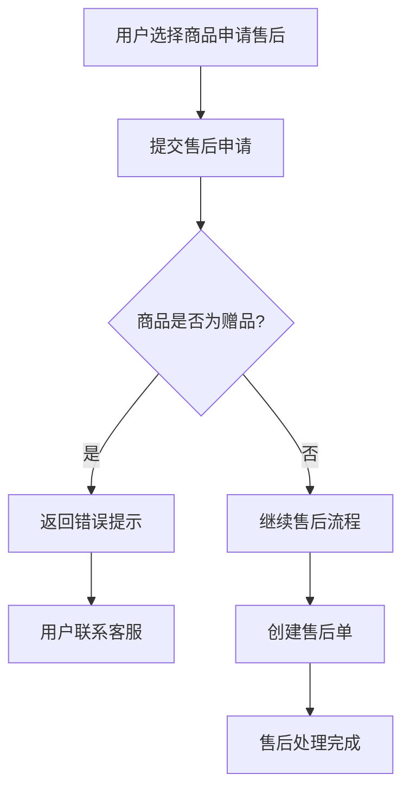
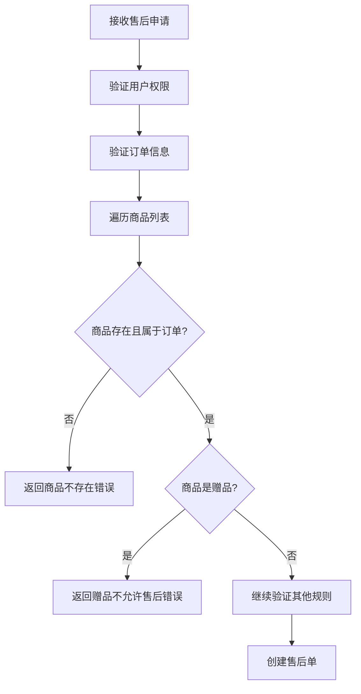

# 赠品售后限制功能

## 概述

为了防止赠品被滥用申请售后，系统在申请售后接口中添加了赠品检查机制。当用户尝试对赠品申请售后时，系统会阻止该操作并返回友好的错误提示。

## 功能特性

### 🎯 **核心逻辑**

- **商品级别检查**：在商品验证阶段检查每个商品的`isGift`属性
- **精确拦截**：只拦截赠品，不影响正常购买商品的售后申请
- **友好提示**：提供清晰的错误信息指导用户联系客服

### 🔍 **检查范围**

系统会拦截以下类型的赠品售后申请：

1. **满赠赠品** (`source = 'coupon_gift'`, `isGift = true`)
2. **兑换券赠品** (`source = 'coupon_redeem'`, `isGift = true`)
3. **其他类型赠品** (`isGift = true`)

### ✅ **允许售后的商品**

- **正常购买商品** (`source = 'normal'`, `isGift = false`)
- **所有非赠品商品** (`isGift = false`)

## 实现细节

### 代码位置

```
packages/order-refund-bundle/src/Service/AftersalesValidator.php
└── validateOrderProduct() 方法中添加赠品检查
```

### 核心代码

```php
private function validateOrderProduct(Contract $contract, string $orderProductId): OrderProduct
{
    $orderProduct = $this->orderProductRepository->find($orderProductId);
    if (null === $orderProduct || $orderProduct->getContract() !== $contract) {
        throw new \InvalidArgumentException('商品不属于此订单: ' . $orderProductId);
    }

    // 检查是否为赠品
    if ($orderProduct->isGift()) {
        throw new \InvalidArgumentException('赠品不允许售后，如有疑问请联系客服');
    }

    return $orderProduct;
}
```

## API 行为

### 请求示例

```json
POST /api/ApplyAftersalesProcedure
{
    "contractId": "12345",
    "type": "return",
    "reason": "quality_issue",
    "description": "商品有质量问题",
    "proofImages": [],
    "items": [
        {
            "orderProductId": "123",
            "quantity": 1
        }
    ]
}
```

### 响应示例

#### 成功场景（正常商品）
```json
{
    "success": true,
    "aftersales": [
        {
            "id": "456",
            "status": "pending",
            "orderProductId": "123"
        }
    ],
    "errors": []
}
```

#### 失败场景（赠品）
```json
{
    "error": {
        "code": -32000,
        "message": "赠品不允许售后，如有疑问请联系客服"
    }
}
```

#### 混合场景（部分成功）
```json
{
    "success": true,
    "aftersales": [
        {
            "id": "456",
            "status": "pending",
            "orderProductId": "123"
        }
    ],
    "errors": [
        "创建商品 456 的售后单失败: 赠品不允许售后，如有疑问请联系客服"
    ]
}
```

## 测试场景

### 单元测试覆盖

1. ✅ **赠品售后被拒绝**
   - 满赠赠品
   - 兑换券赠品
   - 一般赠品

2. ✅ **正常商品售后通过**
   - 正常购买商品
   - 非赠品商品

3. ✅ **边界情况**
   - 不存在的商品
   - 属于其他订单的商品
   - 混合商品类型的订单

### 集成测试覆盖

1. ✅ **完整售后流程测试**
   - 纯赠品订单
   - 纯正常商品订单
   - 混合商品订单

## 业务流程

### 用户操作流程



### 系统验证流程



## 错误处理

### 错误信息标准化

- **错误文案**：`"赠品不允许售后，如有疑问请联系客服"`
- **错误类型**：`InvalidArgumentException` → `ApiException`
- **HTTP状态码**：200（JsonRPC错误响应）

### 日志记录

系统会自动记录以下信息：
- 用户ID
- 订单ID
- 商品ID
- 尝试申请售后的时间
- 错误原因

## 监控指标

### 建议监控的指标

1. **赠品售后申请次数**
   - 按用户统计
   - 按商品类型统计
   - 按时间段统计

2. **客服咨询增长**
   - 与赠品售后相关的咨询
   - 用户满意度调查

3. **误操作率**
   - 用户多次尝试申请赠品售后
   - 用户流失率

## 客服支持

### 常见问题处理

**Q: 为什么我的赠品不能申请售后？**
A: 根据平台政策，赠品不支持售后服务。如果赠品存在质量问题，请联系客服为您处理。

**Q: 我的订单中有正常商品和赠品，能否申请售后？**
A: 可以，但只能对正常购买的商品申请售后，赠品部分不支持售后服务。

**Q: 赠品有质量问题怎么办？**
A: 请联系客服，我们会根据具体情况为您妥善处理。

### 客服处理建议

1. **确认商品类型**：核实用户反馈的商品确实是赠品
2. **了解问题详情**：询问具体的质量问题或使用问题
3. **提供替代方案**：
   - 重新发送相同赠品
   - 提供等价优惠券
   - 其他补偿措施
4. **记录处理结果**：便于后续分析和改进

## 版本变更

### v1.0.0 (当前版本)
- ✅ 添加商品级别的赠品检查
- ✅ 移除基于订单类型的粗粒度检查
- ✅ 支持混合商品订单的差异化处理
- ✅ 完善错误提示和用户引导

### 后续规划
- 🚀 添加赠品售后申请统计分析
- 🚀 优化客服工作流集成
- 🚀 支持特殊赠品的售后政策配置